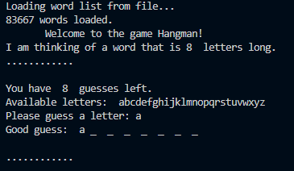

# Hangman
A classic 90's game
You are shown a set of blank letters that match a word or phrase and you have to guess what these letters are to reveal the hidden word. You guess by picking letters from those displayed on the screen above the blanks. You will have 8 chances to guess the word. If you pick a letter that is in the word, the letter will placed in the respective blank in word; however, if you pick a letter that is not in the word, a statement saying, "Oops! You've already guessed that letter", will be displayed. Also your number of chances to guess the word will gradually reduce. With 0 chances in hand the word (answer) will be displayed on the screen. If you correctly guess the word you will see "Congratulations, you won!" displayed on the screen.  
HAPPY PLAYING!!!

Clone this repository and have python installed. Run the .py file and play the game in your command prompt or integrated terminal.

The terminal would look like this:

